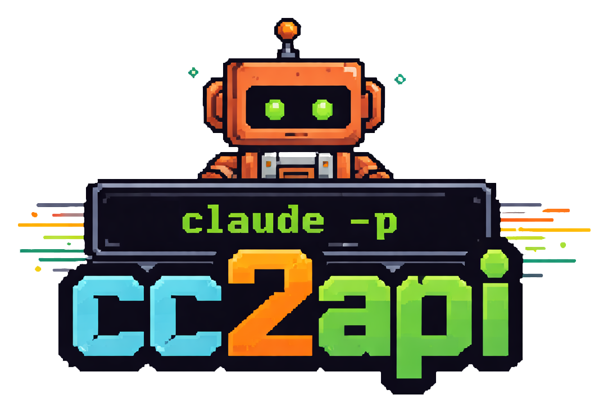

<div align="center">
  
<p align="center"><a href="https://github.com/maxchiron/cc2api">English</a> | <a href="https://github.com/maxchiron/cc2api/blob/main/README-zh.md">中文</a></p>
</div>

<h1>🛡️✅ cc2api-safe</h1>

A simple gateway that exposes the Claude Code CLI as an **Anthropic-compatible API**.

`cc2api-safe` accepts incoming `/v1/messages` requests (Anthropic Messages API format), extracts the `system prompt` and `messages`, invokes `claude -p` via bash, and returns the response in standard Anthropic format — with full **streaming (SSE)** support.

## Why this exists

Starting from April 4, 2026, Claude officially banned third-party OAuth calls to cc, meaning that using `OAuth generated key + forged HTTP headers` is no longer valid. Only requests issued through legitimate claude code are allowed.

While reading `claude --help`, I discovered that the `claude -p/--print` parameter allows for quick Q&A without entering cc's interactive UI.

So I thought, could I utilize `claude -p` to wrap it as an Anthropic API? Thus, this project was born.

This repository is designed for developers who want to bridge existing Anthropic-style clients with the Claude Code command-line interface. The service preserves the request shape expected by Anthropic-compatible tooling while delegating actual text generation to `claude`.

## QuickStart

First, you need to log in to claude code cli via OAuth, which allows subsequent `claude -p` to run correctly internally.

Then, on a machine/terminal where you can normally use `claude -p "hello?"`, proceed with the installation of this project:

```bash
git clone https://github.com/maxchiron/cc2api
cd cc2api
python3 -m venv .venv
source .venv/bin/activate   # macOS/Linux
# .venv\Scripts\Activate.ps1   # Windows PowerShell
pip install -e .
cc2api
```

Send a non-streaming request to the Anthropic endpoint:

```bash
curl -X POST http://127.0.0.1:8080/v1/messages \
  -H "Content-Type: application/json" \
  -d '{
    "model": "claude-sonnet-4-6",
    "max_tokens": 1024,
    "messages": [{"role": "user", "content": "Explain the single responsibility principle."}]
  }'
```

Send a streaming request:

```bash
curl -X POST http://127.0.0.1:8080/v1/messages \
  -H "Content-Type: application/json" \
  -d '{
    "model": "claude-sonnet-4-6",
    "max_tokens": 1024,
    "stream": true,
    "messages": [{"role": "user", "content": "Explain the single responsibility principle."}]
  }'
```

> If you have configured `apikeys.txt`, add `-H "Authorization: Bearer <your-key>"` to every request.

## Key behavior

- Accepts Anthropic Messages API requests (`/v1/messages`)
- Supports **streaming (SSE)** and non-streaming responses
- Extracts `system` prompt and conversation messages
- Runs `claude` via subprocess with controlled environment variables
- Uses default system prompt: `You are a helpful assistant.` when none is provided
- Optional **API key authentication** via `apikeys.txt` (hot-reloaded on every request)

## Supported endpoints

### POST `/v1/messages` (Primary)

Accepts a request body in Anthropic Messages API format. Supports both streaming and non-streaming responses.

**Non-streaming example:**

```json
{
  "model": "claude-sonnet-4-6",
  "max_tokens": 1024,
  "system": "You are a helpful assistant.",
  "messages": [
    {"role": "user", "content": "Translate this into bash: list all Python files recursively."}
  ],
  "effort": "high"
}
```

The `effort` field is optional. Valid values: `low`, `medium`, `high`, `xhigh`, `max`.

Response:

```json
{
  "id": "msg_...",
  "type": "message",
  "role": "assistant",
  "content": [{"type": "text", "text": "..."}],
  "model": "claude-sonnet-4-6",
  "stop_reason": "end_turn",
  "stop_sequence": null,
  "usage": {"input_tokens": 0, "output_tokens": 0}
}
```

**Streaming example:**

```json
{
  "model": "claude-sonnet-4-6",
  "max_tokens": 1024,
  "stream": true,
  "messages": [
    {"role": "user", "content": "Explain quantum entanglement simply."}
  ]
}
```

The response is an SSE stream with standard Anthropic event types (`message_start`, `content_block_delta`, `message_stop`, etc.).

## API Key Authentication

cc2api supports optional API key whitelisting. Keys are read from `apikeys.txt` on **every request**, so changes take effect immediately — no server restart required.

### Setup

Create `apikeys.txt` in the directory where you run `cc2api`, one key per line:

```
sk-mykey-abc123
sk-another-key-xyz
# lines starting with # are ignored
```

When the file exists and contains at least one key, every request to `/v1/messages` and `/v1/chat/completions` must include a valid key in the `Authorization` header:

```
Authorization: Bearer sk-mykey-abc123
```

An invalid or missing key returns `401 Unauthorized`.

When `apikeys.txt` does not exist or is empty, the server runs in **open mode** (no authentication required) — fully backwards-compatible with existing setups.

> **Security note:** `apikeys.txt` is listed in `.gitignore` by default. Never commit real keys to version control.

### Example with auth

```bash
curl -X POST http://127.0.0.1:8080/v1/messages \
  -H "Content-Type: application/json" \
  -H "Authorization: Bearer sk-mykey-abc123" \
  -d '{
    "model": "claude-sonnet-4-6",
    "max_tokens": 1024,
    "messages": [{"role": "user", "content": "Hello!"}]
  }'
```

## Runtime details

The `claude` invocation is executed with these enforced environment variables and CLI flags:

- `CLAUDE_CODE_DISABLE_AUTO_MEMORY=1`
- `ENABLE_CLAUDEAI_MCP_SERVERS=false`
- `--tools ""`
- `--disable-slash-commands`
- `--settings '{"hooks":{},"mcpServers":{}}'`
- `--system-prompt` set from request or fallback default
- `--output-format stream-json` (streaming) / `json` (non-streaming)

The `model` field is passed directly to the `claude` CLI via `--model`. If the model is `claude-code`, `--model` is omitted and the CLI uses its default.

The optional `effort` field maps to `--effort` (values: `low`, `medium`, `high`, `xhigh`, `max`). Omitting it lets the CLI use its default effort level.

## TODO

- [ ] support tool-use and more official functions. (Now not support the official format of tool-use request, but prompt-based tool-use should be working)

## License

This repository is provided as-is for integration and prototyping purposes.
